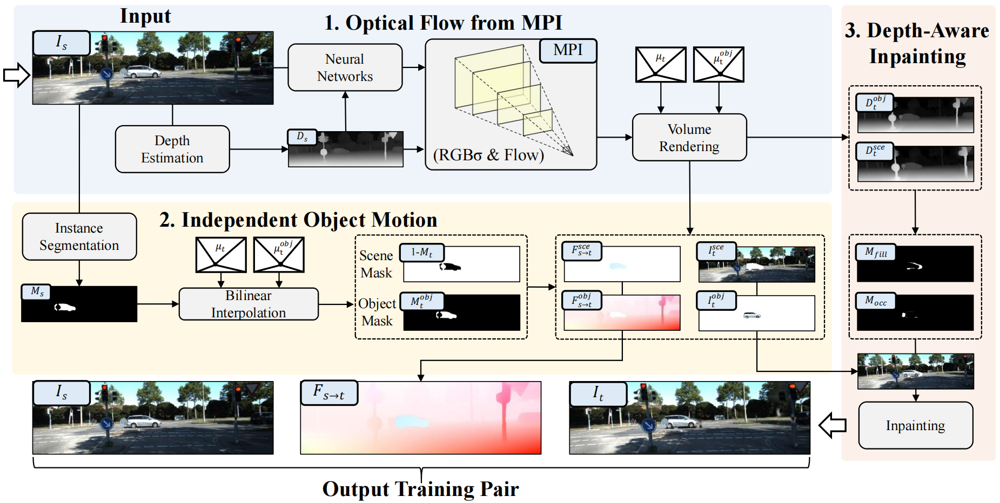

# [ICCV 2023] MPI-Flow: Learning Realistic Optical Flow with Multiplane Images

Code repository is under construction... 🏗️ 🚧 🔨

## News
* `2023/9/13` We release the code and the pretrained model for *MPI-Flow*. Use it to create optical flow from single in-the-wild 2D images!

# AdaMPI



This is a PyTorch implementation of our paper.

[Paper](https://arxiv.org/abs/5110780)

**Abstract**: *The accuracy of learning-based optical flow estimation models heavily relies on the realism of the training datasets. Current approaches for generating such datasets either employ synthetic data or generate images with limited realism. However, the domain gap of these data with real-world scenes constrains the generalization of the trained model to real-world applications. To address this issue, we investigate generating realistic optical flow datasets from real-world images. Firstly, to generate highly realistic new images, we construct a layered depth representation, known as multiplane images (MPI), from single-view images. This allows us to generate novel view images that are highly realistic. To generate optical flow maps that correspond accurately to the new image, we calculate the optical flows of each plane using the camera matrix and plane depths. We then project these layered optical flows into the output optical flow map with volume rendering. Secondly, to ensure the realism of motion, we present an independent object motion module that can separate the camera and dynamic object motion in MPI. This module addresses the deficiency in MPI-based single-view methods, where optical flow is generated only by camera motion and does not account for any object movement. We additionally devise a depth-aware inpainting module to merge new images with dynamic objects and address unnatural motion occlusions. We show the superior performance of our method through extensive experiments on real-world datasets. Moreover, our approach achieves state-of-the-art performance in both unsupervised and supervised training of learning-based models.*

# Document for *AdaMPI*
## Environment
```
conda create -n adampi python=3.8

# here we use pytorch 1.11.0 and CUDA 11.3 for an example 

# install pytorch
pip install https://download.pytorch.org/whl/cu113/torch-1.11.0%2Bcu113-cp38-cp38-linux_x86_64.whl

# install torchvision
pip install https://download.pytorch.org/whl/cu113/torchvision-0.12.0%2Bcu113-cp38-cp38-linux_x86_64.whl

# install pytorch3d
conda install https://anaconda.org/pytorch3d/pytorch3d/0.6.2/download/linux-64/pytorch3d-0.6.2-py38_cu113_pyt1100.tar.bz2

# install other libs
pip install \
    numpy==1.19 \
    scikit-image==0.19.1 \
    scipy==1.8.0 \
    pillow==9.0.1 \
    opencv-python==4.4.0.40 \
    tqdm==4.64.0 \
    moviepy==1.0.3 \
    pyyaml \
    matplotlib \
    scikit-learn \
    lpips \
    kornia \
    focal_frequency_loss \
    tensorboard \
    transformers

cd external/forward_warping
bash compile.sh
cd ../..
```
## Contact
If you have any questions, please contact Yingping Liang (liangyingping@bit.edu.cn).

## License and Citation
This repository can only be used for personal/research/non-commercial purposes.
Please cite the following paper if this model helps your research:

    @inproceedings{liang2023mpi,
        author = {Liang, Yingping and Liu, Jiaming and Zhang, Debing and Ying, Fu},
        title = {Single-View View Synthesis in the Wild with Learned Adaptive Multiplane Images},
        booktitle = {In the IEEE International Conference on Computer Vision (ICCV)},
        year={2023}
    }

## Acknowledgments
* The code is heavily borrowed from [AdaMPI](https://github.com/yxuhan/AdaMPI), we thank the author for their great effort.
